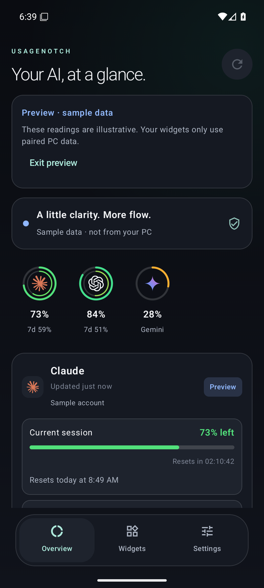
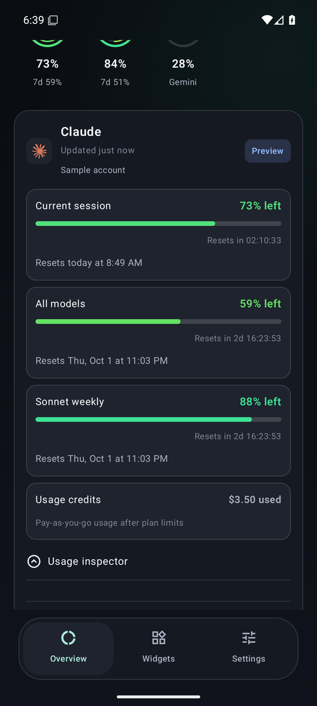
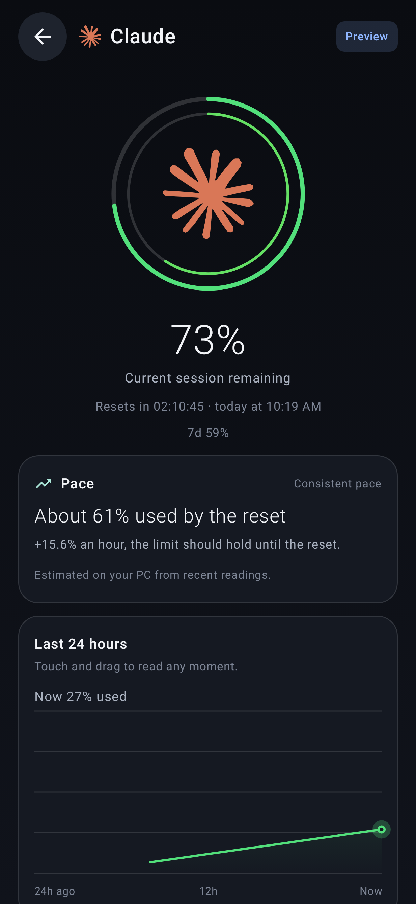
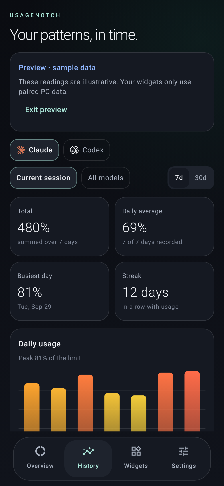
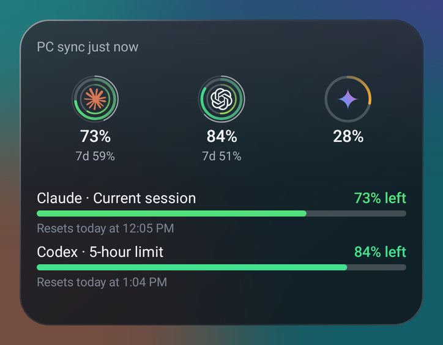
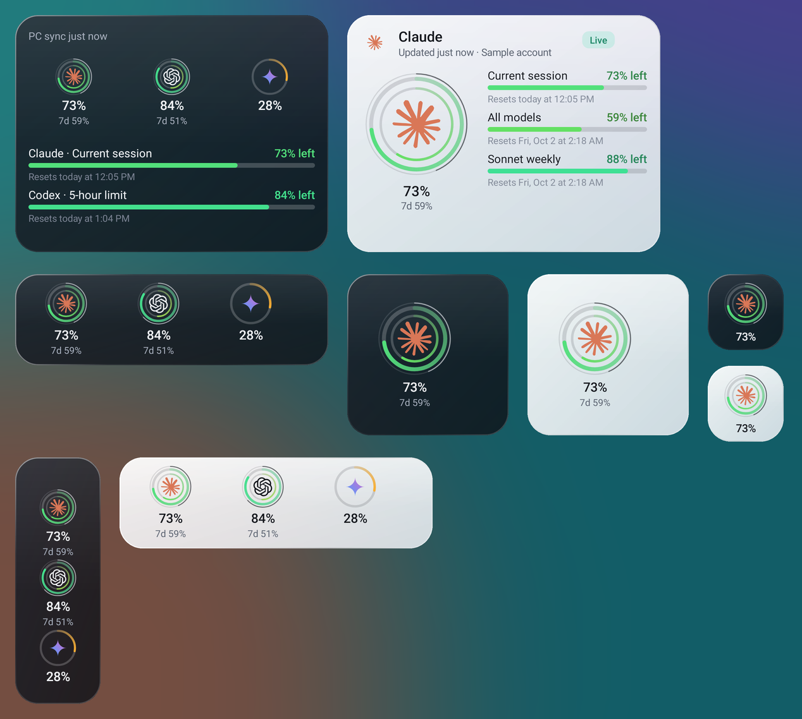

# UsageNotch for Android

Your Claude, Codex, Gemini and Cursor usage limits on your phone, with the desktop dock's rings, widgets in any size, a live countdown, usage alerts and 30-day history. It's a companion to [UsageNotch for Windows](https://github.com/Arnav-Dugad/UsageNotch-Windows).

## Download

| You need | File | Where |
| --- | --- | --- |
| **Android app** (Android 9 or newer) | `UsageNotch-1.3.0.apk` | [Latest release](https://github.com/Arnav-Dugad/UsageNotch-Android/releases/latest) |
| **UsageNotch for Windows** 2.3 or newer (2.4 for history and pace), which shares with your phone itself | `UsageNotch.exe` | [Windows releases](https://github.com/Arnav-Dugad/UsageNotch-Windows/releases/latest) |

All downloads, with a short guide: **[arnav-dugad.github.io/UsageNotch-Windows](https://arnav-dugad.github.io/UsageNotch-Windows/)**

The APK is sideloaded, not from the Play Store. When you open it, Android asks you to allow installs from your browser or file manager. Updates install over it, and the app tells you when one is available. If an earlier version closed immediately on your phone, install 1.3.0: the 1.0.x startup crash was fixed in 1.1.

<p>





</p>

Screens from Android 16 with sample data.

## Pair in one scan

1. **On Windows**, update to [UsageNotch 2.3](https://github.com/Arnav-Dugad/UsageNotch-Windows/releases/latest) (installed copies update themselves). Open **Settings → Phone** and turn on **Share usage with paired phones**. If Windows Firewall asks, allow **Private networks**.
2. **On Android**, open UsageNotch and tap **Scan QR code**. Point the phone at the code on your PC. The scanner is built in and works on any phone, including ones without Google Play services; you can also scan a screenshot of the code.

That's it. With no app installed yet, scan the code with the phone's camera: the page that opens offers the download, then hands the pairing to the app in one tap. The app always asks before pairing from a link.

Other ways to pair: **Paste pairing code** (Copy pairing code on the PC, send it to yourself) or **Import PC pairing** (Save pairing file on the PC). Phone and PC need the same Wi-Fi or a private VPN such as Tailscale.

**Already using UsageNotch Link?** Windows 2.3 includes it. Open Settings → Phone and choose **Switch to built-in**. Your phone stays paired: same key, same certificate.

## Widgets in any size

Add them from the **Widgets** tab or your launcher's widget list, then resize freely. Each size gets a layout that fits:



- **1×1**: one ring with the provider's logo and percentage.
- **A row or a column**: the desktop dock, with each provider's ring, percentage and "7d" weekly figure.
- **Larger**: the rings plus each limit's colour-graded bar and reset time.
- **Focus widget**: one provider with a big dual ring (outer: session, inner: weekly). Long-press it to choose the provider.

Rings use the desktop's exact colour ramp (green → amber → red as a limit fills) and the real Claude, OpenAI, Gemini and Cursor marks. Widgets follow your Light/Dark choice.

## What you get

- The desktop popup's layout for every provider: *Updated just now*, account name (when the dock shows it), a Live/Saved/Sign in status pill, each limit with its bar, amount, live *Resets in* countdown and local *Resets today at 3:29 PM*.
- **Full-screen provider view**: tap a ring and it grows into a large ring with the pace forecast and a 24-hour chart you can scrub with your finger (with light haptic ticks). The back gesture shrinks it away.
- **Pace** from the desktop's forecast: "At this pace: limit around 4:10 PM".
- **History tab**: 7 or 30 days of daily usage, total, daily average, busiest day, your streak, and a weekday × hour map of your busiest times. Missing days and hours are shown as no data, never as zero. Needs Windows 2.4.
- **Live countdown**: an ongoing notification with the percentage and a countdown to the reset, also on the lock screen. On Android 16 it's a Live Update with a status-bar chip.
- **Usage alerts** at 80% and 95% used, and when the pace says a limit runs out within two hours before it resets. **Reset alerts** when a limit renews, with a gentle vibration.
- **Quick Settings tile** with the percentage; tap it to refresh. Add it from the Widgets tab.
- **Wallpaper colors** (Material You) on Android 12+, a themed monochrome icon, rolling numbers, a ring that glows above 90%, and a glass dock that follows you as you scroll. Reduce motion turns the animations off.
- Pull down to refresh. Update notices, Light/Dark/System theme, 12/24-hour clock.
- Pay-as-you-go credits and API spend shown with their amounts.
- Safe mode: if the app ever fails to start twice, it opens a plain screen to share a crash report or clear its data.

## When your PC is off or you're away

- **Everything keeps working offline.** Saved readings stay visible with their age, countdowns keep running, and the status reads *PC offline*.
- **Limits that reset show Renewed.** Widgets flip at the reset time. With Reset alerts on, your phone notifies you ("Claude limit renewed"). This works with the laptop shut down.
- **Optional internet sync** gets readings on mobile data. In Windows 2.4 Settings → Phone, choose **Turn on internet sync**, click **Generate token** on the GitHub page that opens and copy the token. Your phone picks up the new settings by itself the next time it reaches your PC on Wi-Fi; there's no new code to scan. Each reading is encrypted on your PC (AES-256-GCM) and stored in a **secret gist in your own GitHub account**. Only your paired phone has the key. GitHub caches gist files for up to about five minutes.

A phone can't observe *new* usage while every PC running UsageNotch is off. Your AI sign-ins stay on Windows, and nothing copies them to your phone.

## Privacy and security

- AI credentials and account identifiers never leave Windows. The phone receives percentages, limits, reset times, 24 hours of readings, 30 days of daily and hourly totals, pace estimates, and the account display name only if the dock shows it.
- Wi-Fi pairing uses HTTPS pinned to your PC's own certificate plus a random 256-bit key. Plain HTTP, redirects and public addresses are rejected. The pairing is encrypted with Android Keystore and excluded from backups.
- The QR code keeps its pairing in the part of the web address browsers never send to a server. The pairing page removes it from the address bar immediately.
- The QR scanner runs inside the app (ZXing). It asks for the camera only when you open it; frames are analysed in memory and never saved or sent anywhere. Screenshots are chosen with Android's photo picker, so the app never gets access to your other photos.
- **Revoke all paired phones** (Windows Settings → Phone) invalidates every code and file, including the internet sync key.
- No ads, analytics or tracking. The app contacts your PC, your sync gist if you set one up, and GitHub Releases for update checks (can be turned off).

## Troubleshooting

| What you see | What to do |
| --- | --- |
| *Couldn't reach your PC* | In Windows Settings → Phone, check sharing is on and your Wi-Fi address is selected (not `vEthernet`/WSL). Allow UsageNotch on Private networks in Windows Firewall. |
| The camera doesn't start | Allow the camera for UsageNotch in Android Settings → Apps, or tap **Scan a screenshot instead**. **Paste pairing code** also works. |
| No Live countdown or alerts | Allow notifications for UsageNotch. The countdown follows one provider; choose it under Live countdown in Settings. |
| *PC offline* | Normal while the PC sleeps or you're away. Turn on internet sync for readings away from home. |
| *Pairing was revoked* or *PC identity changed* | Scan the new code in Windows Settings → Phone. |
| The widget time looks old | Android refreshes about every 15 minutes and may delay it to save battery. Tap ↻ on a large widget. |
| The app closed unexpectedly | Reopen it and tap **Share report**, then [open an issue](https://github.com/Arnav-Dugad/UsageNotch-Android/issues). |

## Build from source

JDK 17–25, Android SDK 36 and the included Gradle wrapper:

```sh
./gradlew :app:testDebugUnitTest :app:lintDebug :app:assembleDebug
./gradlew :app:assembleSmoke   # optimized (R8) build signed with the debug key, for launch tests
```

The `companion/` folder holds the standalone UsageNotch Link for Windows 2.2 and older. Windows 2.3 includes it. See [releasing](docs/RELEASING.md) and [verification](docs/VERIFICATION.md). The package is `io.github.arnavdugad.usagenotch`, and updates must use the same signing certificate.

Independent community project, not affiliated with Anthropic, OpenAI, Google, Cursor or GitHub. Brand marks: Simple Icons (CC0) and Lobe Icons (MIT).
