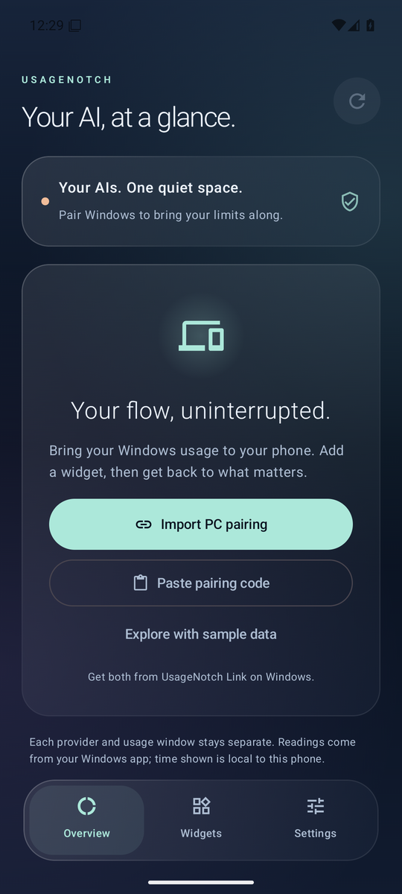
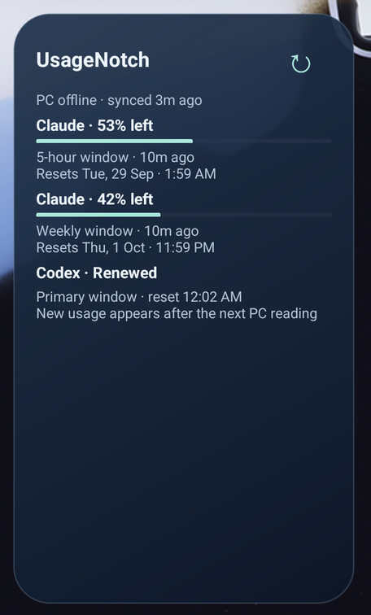

# UsageNotch for Android

Your Claude, Codex, Gemini and Cursor usage limits on your phone, with home-screen widgets and reset alerts. It's a companion to [UsageNotch for Windows](https://github.com/Arnav-Dugad/UsageNotch-Windows).

## Download

| You need | File | Where |
| --- | --- | --- |
| **Android app** (Android 9 or newer) | `UsageNotch-1.1.0.apk` | [Latest release](https://github.com/Arnav-Dugad/UsageNotch-Android/releases/latest) |
| **UsageNotch Link** for your Windows PC | `UsageNotch-Link-1.1.0-win-x64.zip` | [Latest release](https://github.com/Arnav-Dugad/UsageNotch-Android/releases/latest) |
| **UsageNotch for Windows** 2.2.0 or newer | `UsageNotch.exe` | [Windows releases](https://github.com/Arnav-Dugad/UsageNotch-Windows/releases/latest) |

All downloads, with a short guide: **[arnav-dugad.github.io/UsageNotch-Windows](https://arnav-dugad.github.io/UsageNotch-Windows/)**

> **If 1.0.0 or 1.0.1 closed immediately on your phone**, install 1.1.0. The 1.0.1 download was accidentally built from the 1.0.0 code, so it still had the startup crash. 1.1.0 installs over either version.

The APK is sideloaded, not from the Play Store. When you open it, Android asks you to allow installs from your browser or file manager. Future versions install over it, and the app tells you when one is available.

<p>



</p>

Screens from Android 16 with sample data. The widget shows the offline state: saved readings stay visible, and the Codex window has passed its reset time.

## Set up in five minutes

1. **On Windows**, keep [UsageNotch for Windows](https://github.com/Arnav-Dugad/UsageNotch-Windows/releases/latest) running with your AI accounts connected.
2. Extract `UsageNotch-Link-1.1.0-win-x64.zip` and run `UsageNotch.Link.exe`. Click **Start secure link**. If Windows Firewall asks, allow it on **Private** networks.
3. Check the address list shows your Wi-Fi (for example `192.168.1.8 · Wi-Fi`), then click **Copy pairing code** or **Export pairing file**.
4. Get the code or file to your phone privately, for example a message to yourself or a USB copy. It's an access key, so don't post it anywhere public.
5. **On Android**, tap **Paste pairing code** or **Import PC pairing**. You can also open a `.usagenotch` file straight from your file manager.
6. Open **Widgets → Add to home screen**. Turn on **Reset alerts** in Settings if you want a notification when a limit resets.

Tick **Start with Windows in the background** in Link, and it keeps your phone updated without you opening it again. Closing its window leaves it running in the notification area.

## When your PC is off or you're away from home

- **Everything keeps working offline.** The app and widgets show your last readings with their age, countdowns keep running, and the status reads *PC offline*, not an error.
- **Limits that reset while you're away show Renewed.** At each reset time the widget flips to *Renewed*, and with Reset alerts on your phone notifies you ("Claude limit renewed"). This comes from your saved readings, so it works with the laptop shut down.
- **Optional internet sync** gets fresh readings on mobile data or any Wi-Fi. In Link, open **Internet sync**, create a GitHub token with *Gists: Read and write*, and paste it. Then export a new pairing code and paste it on your phone. Link encrypts each reading with AES-256-GCM before uploading it to a **secret gist in your own GitHub account**. The key exists only in your pairing file, so GitHub stores ciphertext only. After the PC shuts down, the phone can still fetch the last reading it uploaded. GitHub caches gist files for up to about five minutes, so a brand-new reading can take that long to arrive.

**Limits of this approach:** a phone can't observe *new* usage while every PC running UsageNotch is off. Only the Windows app talks to Claude, ChatGPT, Gemini and Cursor, because that's where your sign-ins live. UsageNotch deliberately doesn't copy those credentials to your phone. After a reset, the app says *Renewed* and waits for the next real reading rather than guessing a percentage.

## What you get

- Every provider the Windows app records, including Claude, Codex, Gemini, Cursor and API spend, with each usage window kept separate.
- Percentage left or used, second-by-second countdowns, exact local reset times, AM/PM or 24-hour clock.
- A 24-hour chart of observed readings. Gaps and resets are never joined into a misleading line.
- Overview and single-provider widgets with a refresh button and clearly dated readings.
- Reset alerts, update notices, reduced motion, and phone and tablet layouts.
- Safe mode: if the app ever fails to start twice in a row, it opens a plain screen where you can share a crash report or clear its data.

## Privacy and security

- AI credentials, account names and account IDs never leave Windows. The phone receives percentages, reset times and recent readings.
- Wi-Fi pairing uses HTTPS pinned to your PC's exact certificate, plus a random 256-bit key. The app rejects plain HTTP, redirects and public addresses. The pairing is encrypted with Android Keystore and excluded from backups.
- Internet sync is off by default. When it's on, only ciphertext leaves your PC, in a secret gist you own. Your GitHub token stays on the PC, encrypted with Windows DPAPI. Turning sync off deletes the gist.
- **Revoke all paired phones** in Link invalidates every pairing file and code, including their internet sync key.
- No ads, analytics or tracking. The app contacts only your PC, your sync gist if you set one up, and GitHub Releases for update checks, which you can turn off.
- Widgets are visible to anyone who sees your home screen.

## Troubleshooting

| What you see | What to do |
| --- | --- |
| *Couldn't reach your PC* while pairing | In Link, click **Start secure link**, pick the Wi-Fi address (not `vEthernet`/WSL), and allow Link on Private networks in Windows Firewall. Phone and PC must share a Wi-Fi network or private VPN such as Tailscale. |
| *PC offline* | Normal while the PC sleeps or you're away. Turn on internet sync for readings away from home. |
| *Pairing was revoked* or *PC identity changed* | Export a new pairing code in Link and paste it on the phone. |
| Widget time looks old | Android runs background refresh about every 15 minutes and can delay it to save battery. Tap ↻ on the widget. |
| The app closed unexpectedly | Reopen it and tap **Share report** on the notice, then [open an issue](https://github.com/Arnav-Dugad/UsageNotch-Android/issues). Reports contain the version, phone model and error only. |

## Build from source

JDK 17–25, Android SDK 36 and the included Gradle wrapper:

```sh
./gradlew :app:testDebugUnitTest :app:lintDebug :app:assembleDebug
./gradlew :app:assembleSmoke   # optimized (R8) build signed with the debug key, for launch tests
```

Windows Link (.NET 8):

```powershell
dotnet build companion/UsageNotch.Link.csproj -c Release
dotnet companion/bin/Release/net8.0-windows/UsageNotch.Link.dll --self-test
```

See [releasing](docs/RELEASING.md) and [verification](docs/VERIFICATION.md). Release APKs are signed with a persistent private key. The package is `io.github.arnavdugad.usagenotch`, and updates must use the same certificate.

Independent community project, not affiliated with Anthropic, OpenAI, Google, Cursor or GitHub.
